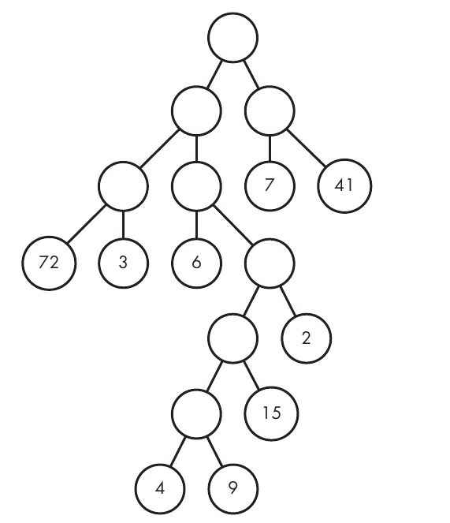

# Halloween Haul

### Problem Description

You just moved into a strange neighbourhood. You notice that the roads in your neighbourhood form a binary tree, with the houses forming the leaves of the tree. But this doesn't really matter to you, because it's all about the candy during Halloween! However having just moved in, you might end up getting lost. So you create a plan: start at the root of your neighbourhood and walk to every house and ask for candy! Before setting off on your adventure however, you want to calculate the minimum number of roads you'll need to walk and the total amount of candy you'll get.

The input will contain 5 test cases. Each test case is a line containing a single string, less than 256 characters long, describing the tree your neighbourhood forms. A binary tree can be recursively described as either:

* A leaf **c** , **1 ≤ c ≤ 20** , the amount of candy received from the house;
* **(t t)** - where **t** represents a tree.

For example, a tree represented by **((1 5) 8)** would look like:

The output will contain 5 lines of output, each a pair of integers **r** and **c** . **r** is the minimum number of roads needed to be traversed to get all the candy (starting from the root (top) of the tree, and not needing to return). **c** represents the total amount of candy you'll collect.

<u>Summary</u>: In this problem, we want to collect all the candy from a particular neighborhood as efficiently as possible. The neighborhood has a rigid though strange shape, as shown in the figure below.

The circles with numbers in them are houses. Each number gives the amount of candy you’ll get by visiting that house. Candy values are at most two digits. The circle at the top is your starting location. The circles without numbers are intersections between streets, where you choose which way to walk next. The lines that connect circles are the streets. Moving from one circle to another corresponds to walking one street.

### Input

The input consists of exactly five lines, where each line is a string of at most 255 characters that describes a neighborhood. First, a tree of a single house node is represented simply as the text of the candy value.

    4

A tree whose root is a nonhouse node is represented by the following, in order: an opening parenthesis, a first smaller tree, a space, a second smaller tree, and a closing parenthesis. The first smaller tree in there is the left subtree, and the second smaller tree is the right subtree.

    (4 9)

Therefore, we have the following:
- If the text is the digits of integer **c**, then the tree is a single house node with **c** candy.

- If the text starts with an opening parenthesis, then the root of the tree is a nonhouse node. After the opening parenthesis, the text contains the tree’s left subtree, a space, the tree’s right subtree, and a closing parenthesis.

### Output

Our output will be five lines of text, with each line corresponding to one of the five input lines. Each line of output contains two integers separated by a space: the minimum number of streets walked to obtain all of the candy and the total amount of candy obtained.

<u>Requirements</u>: The time limit for solving the test cases is two seconds.
